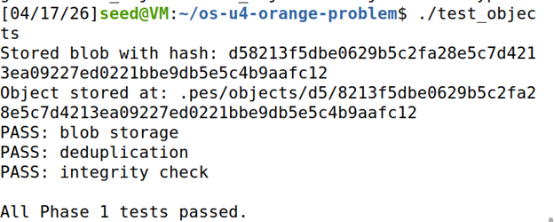
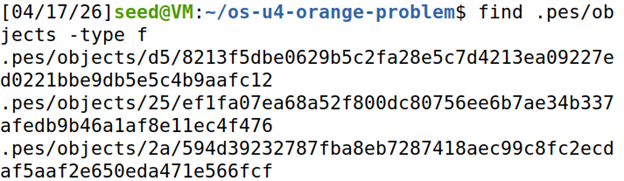
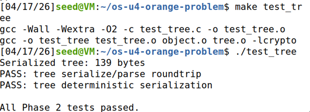
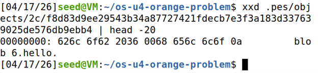
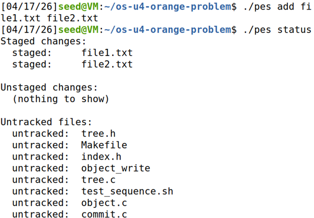
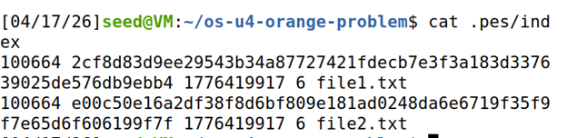
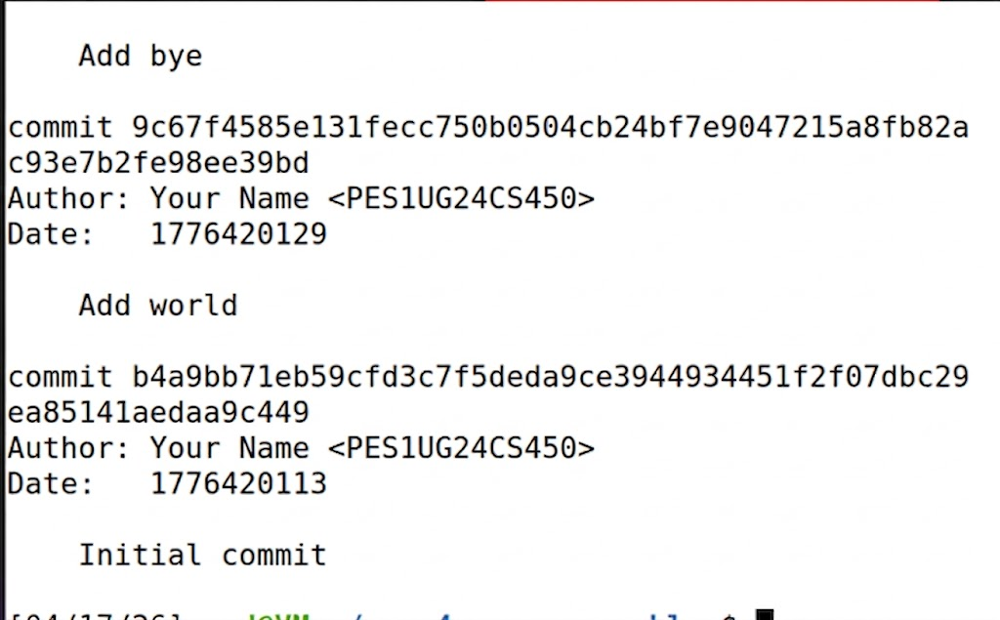
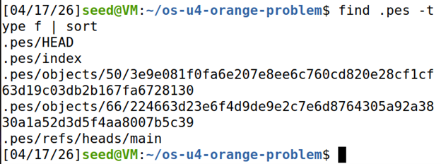
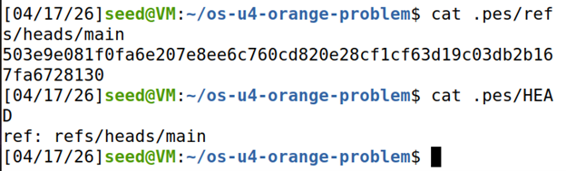
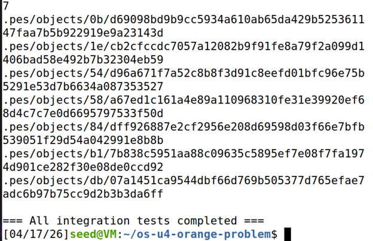

# PES Version Control System (PES-VCS)

## Author
Your Name <PES1UG24CS441>

---

# 🟢 Phase 1: Object Store

## 1A: Object Tests

## 1B: Object Storage Structure

---

# 🟢 Phase 2: Tree Objects

## 2A: Tree Tests

## 2B: Tree Object (Hex Dump)

---

# 🟢 Phase 3: Index (Staging Area)

## 3A: Init → Add → Status

## 3B: Index File

---

# 🟢 Phase 4: Commit System

## 4A: Commit Log

## 4B: Repository Structure

## 4C: HEAD and Branch Reference

---

# 🟢 Final Integration Test

---

# 🧠 System Overview

This project implements a simplified Git-like version control system with the following components:

- **Object Store**: Stores blobs, trees, and commits using SHA-256 hashes.
- **Index**: Maintains staged files and metadata.
- **Tree Objects**: Represent directory structure.
- **Commits**: Store snapshots and history with parent linking.
- **HEAD & Refs**: Track current branch and commit.

---

# 🟡 Phase 5: Branching & Checkout

## Q5.1
To implement `pes checkout <branch>`:

- Update `.pes/HEAD` to point to the new branch
- Read commit hash from `.pes/refs/heads/<branch>`
- Load tree corresponding to commit
- Update working directory to match tree contents

Complexity arises because:
- Files must be safely overwritten
- Uncommitted changes must be preserved or blocked

---

## Q5.2
To detect a dirty working directory:

- Compare working directory files with index entries
- If file content or metadata differs → modified
- Compare index with target branch tree
- If conflict exists → abort checkout

---

## Q5.3
Detached HEAD means:

- HEAD directly points to a commit, not a branch
- New commits are not referenced by any branch

Recovery:
- Create a new branch pointing to that commit
- Example: `git branch new-branch <commit>`

---

# 🟡 Phase 6: Garbage Collection

## Q6.1
Algorithm:

1. Start from all branch heads
2. Traverse commits recursively
3. Mark all reachable objects (tree + blobs)
4. Delete unmarked objects

Data structure:
- Hash set for visited objects

For 100k commits:
- Visit all commits + trees + blobs → potentially hundreds of thousands of objects

---

## Q6.2
Race condition:

- GC deletes an object while commit is being created
- Commit may reference a deleted object → corruption

Git avoids this by:
- Using locks
- Running GC separately
- Ensuring objects are referenced before deletion

---

# ✅ Conclusion

## ✅ Conclusion

This project demonstrates how Git internally manages version control using core components such as blobs, trees, commits, and indexing. By implementing these features, we gained a deeper understanding of how data is stored, tracked, and retrieved efficiently.
The project also highlights the importance of consistency and reliability in version control systems, especially in handling concurrent operations and maintaining data integrity.
Overall, this implementation provides practical insight into Git’s working principles and reinforces key concepts of file versioning and repository management.
